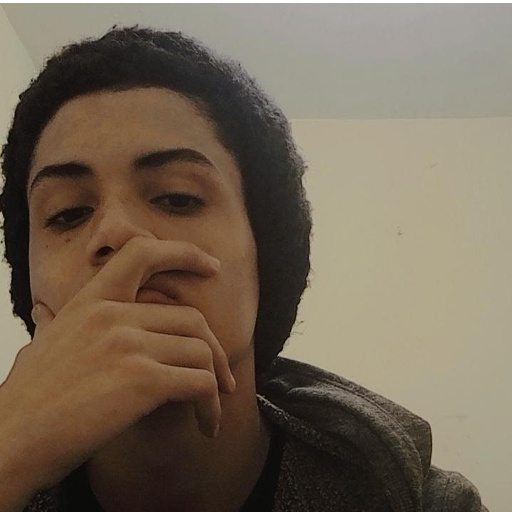

<!DOCTYPE html>
<html lang="pt-BR">
<head>
    <meta charset="UTF-8">
    <meta name="viewport" content="width=device-width, initial-scale=1.0">
    <title>No Caos em que a Gente Brevemente se Desfaz</title>
    
</head>
<body>
    <header>
        <h1>No Caos em que a Gente Brevemente se Desfaz</h1>
        
        

            <a href="https://loja.uiclap.com/titulo/ua50831/" target="_blank">Comprar Agora (Físico)</a>
        

        

            <a href="https://www.amazon.com.br/Caos-que-Gente-Brevemente-Desfaz-ebook/dp/B0D3H3Q6BK" target="_blank">Comprar pela Amazon (Versão Digital)</a>
        

        

            <a href="https://www.instagram.com/lana_umpoeta" target="_blank">ver mais</a>
        

    </header>

    

        <h2>Sinopse</h2>
        

            “No Caos em que a Gente Brevemente se Desfaz”, Carlos Lana conduz o leitor em uma jornada emocional através dos meandros da mente e do coração de um “menino desfeito”. Lana revela em sua poesia as complexidades de problemas de identidade, traumas, vícios e dependência.
        

        

            Versos poderosos, imagens fortes, metáforas, uma dose de absurdo visceral e um convite ao leitor de buscar no fim de tudo um caminho no meio do caos à ordem.
        

        

            A obra é um reflexo do autor, um olhar para dentro, através do espelho; e, assim, desfazer o Eu que imagina em todo o caos que é, o caos que somos na aleatoriedade da vida, brevemente. No caos em que a gente, brevemente, se desfaz.
        

        

            Poemas repletos de “sonhos introjetados / momentos quebrados / promessas / e agulhas”. Cada verso é uma janela para sua alma, oferecendo aos leitores uma visão única de sua perspectiva sobre a vida, o amor e o abandono.
        

        

            <h2>Sobre o Autor</h2>
            
            

                "Sou Carlos Lana, um jovem poeta, você provavelmente não me conhece e tudo bem, que essa pequena bio seja uma carta de cumprimento. Eu escrevo poesia desde de 2020, mas comecei a minha jornada como um escritor desde os meus 10 anos (2014). Sou de São Paulo mas vim morar com minha família no Rio de Janeiro em meados 2018, onde tive verdadeiramente meu primeiro contato com a poesia e com a leitura no geral e desde então sou um leitor assíduo. Já escrevi de tudo e em vários estilos, mas é na poesia que me encontro. Espero que goste de minhas palavras!".
            

            

                Lana é um poeta diverso que domina a linguagem em seus escritos com o uso de imagens poéticas poderosas, cheias de simbolismo e metáforas intrigantes. Seus poemas podem variar do absurdo ao surreal, sendo secos e profundos, com um toque de ironia sobre a realidade e uma reflexão demorada e particular sobre a vida e a morte, o ordinário e o cotidiano.
            

            

                Seu estilo envolve uma escrita envolvente, que pode ser ao mesmo tempo difícil e fácil de entender, repleta de camadas, como se cada poema tivesse uma história inteira por trás. Ele tem um ritmo próprio, usa rimas eventuais (embora dê pouca importância às métricas, com exceção dos haicais), e seus escritos são repletos de diálogos, que se tornaram uma marca registrada de Carlos.
            

            

                Ele é o autor do e-book “Poemas para Você: carta aberta de um coração”, disponível na Amazon.com, publicou de forma independente o seu novo livro: “No Caos em que a Gente Brevemente se Desfaz", disponível físico na loja Uiclap e de forma digital pela Amazon.
            

            

                E atualmente participou do Antologia de Contos de Horror Cósmico denominada "Além do Limiar da Loucura".
            

        

        

            <a href="https://www.instagram.com/lana_umpoeta" target="_blank">Instagram</a>
        

    

</body>
</html>
